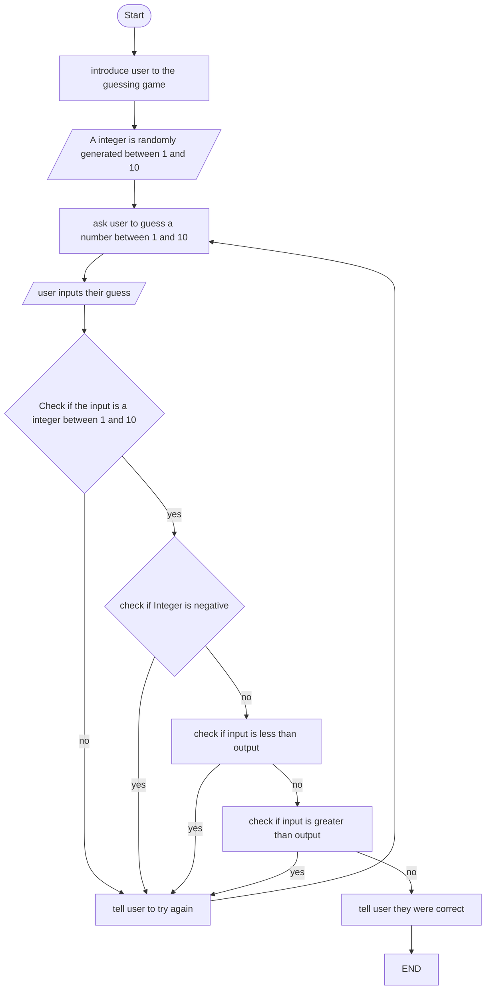

## Guessing Game Flow Chart

## Documentation
1. A random integer between 1 and 10 is generated.  
2. The game starts and the following rules are explained to the user,  
   * the game will generate a random integer between 1 and 10.  
   * the user must guess what this integer is.  
   * the integer cannot be a negative number.
3. The user enters their guess
   * if their guess is not a integer between 1 and 10 they will be told to try again.
   * if their guess is a negative integer they will be told to try again.
   * if their guess is less than the rng output they will be told to try again.
   * if their guess is greater than the rng output they will be told to try again.
4. if the program reaches this point the user will be told they were correct, and that they have won the game. This point will only be reached if the users integer input matches the rng output
