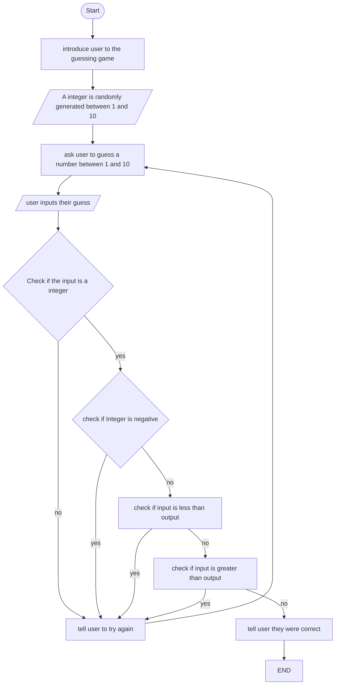

```mermaid
flowchart TD
    Start([Start]) --> Introduction
    Introduction[introduce user to the guessing game] --> RNG[/A integer is randomly generated between 1 and 10/]
    RNG--> UserInputRequest[ask user to guess a number between 1 and 10]
    UserInputRequest --> UserInput[/user inputs their guess/]
    UserInput --> IntegerCheck{Check if the input is a integer}
    IntegerCheck -->|no| TryAgain[tell user to try again]
    TryAgain --> UserInputRequest
    IntegerCheck -->|yes| NegativeCheck{check if Integer is negative}
    NegativeCheck -->|yes| TryAgain[tell user to try again]
    NegativeCheck -->|no| LessThanCheck[check if input is less than output]
    LessThanCheck -->|yes| TryAgain[tell user to try again]
    LessThanCheck -->|no| GreaterThanCheck[check if input is greater than output]
    GreaterThanCheck -->|yes| TryAgain[tell user to try again]
    GreaterThanCheck -->|no| Correct[tell user they were correct]
    Correct --> END
```
